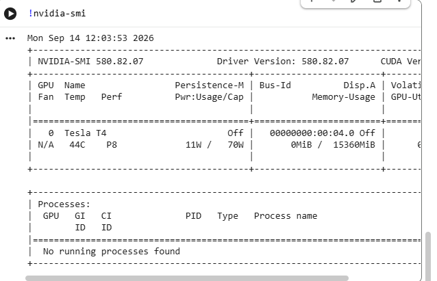
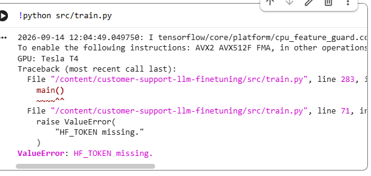

# Customer Support LLM Fine-Tuning

Customer Support LLM Fine-Tuning is a domain-specific large language model adaptation project that fine-tunes Qwen 2.5 3B for customer support using QLoRA.

The project demonstrates parameter-efficient fine-tuning of an open-source LLM using 4-bit quantization, LoRA adapters, Hugging Face Transformers, PEFT, TRL, and Weights & Biases.

## Overview

The goal of this project is to improve the behavior of a general-purpose language model for customer support tasks.

The base Qwen 2.5 3B model is fine-tuned on a customer support dataset containing thousands of support-style requests and responses.

The project covers the full fine-tuning workflow:

- Dataset preparation
- Prompt formatting
- Train, validation, and test split generation
- 4-bit NF4 quantization
- LoRA adapter configuration
- QLoRA fine-tuning
- Training monitoring with Weights & Biases
- Model evaluation
- Base vs fine-tuned model comparison
- Inference with the trained adapter

## Model

Base model:

```text
Qwen/Qwen2.5-3B
```

Fine-tuning method:

```text
QLoRA
```

The base model is loaded in 4-bit precision to reduce GPU memory usage, while LoRA adapters are trained on selected transformer layers.

## Dataset

The project uses the Bitext Customer Support LLM Chatbot Training Dataset from Hugging Face.

The dataset contains customer support requests and example responses covering areas such as:

- Order management
- Password recovery
- Delivery issues
- Payment methods
- Account access
- Refunds and cancellations

The project uses:

```text
4,000 training examples
300 validation examples
300 test examples
```

## Fine-Tuning Architecture

```text
Customer Support Dataset
        |
        v
Prompt Preparation
        |
        v
   Qwen 2.5 3B
        |
        v
4-bit NF4 Quantization
        |
        v
   LoRA Adapters
        |
        v
Supervised Fine-Tuning
        |
        v
Fine-Tuned Customer
   Support Model
```

## Training Configuration

The model is trained using QLoRA on a Google Colab T4 GPU.

Main configuration:

```text
Base Model: Qwen 2.5 3B
Quantization: 4-bit NF4
LoRA Rank: 32
LoRA Alpha: 64
LoRA Dropout: 0.1
Epochs: 1
Optimizer: Paged AdamW 32-bit
Learning Rate: 1e-4
Scheduler: Cosine
```

## Training Results

The training process is monitored using Weights & Biases.

Final metrics:

```text
Train Loss: 0.8828
Validation Loss: 0.8094
Validation Token Accuracy: 75.4%
Training Time: ~27 minutes
```

## Application Preview

### Training Metrics

The following image shows the training and validation metrics recorded during fine-tuning.



### Base vs Fine-Tuned Evaluation

The evaluation compares the original Qwen model with the fine-tuned customer support adapter on unseen requests.



## Base vs Fine-Tuned Model

The base model and the fine-tuned model are evaluated on unseen customer support requests.

The fine-tuned model produces more structured, support-oriented responses and follows customer support patterns more consistently.

Example:

```text
Customer:
Help me reset my user profile password.

Base Qwen:
Requests additional account information and asks for the current password.

Fine-Tuned Qwen:
Provides a structured password reset flow using the forgot-password process.
```

## How It Works

1. The customer support dataset is loaded from Hugging Face.
2. The data is divided into training, validation, and test sets.
3. Each example is converted into an instruction-response prompt.
4. Qwen 2.5 3B is loaded using 4-bit NF4 quantization.
5. LoRA adapters are attached to selected transformer layers.
6. The model is fine-tuned using supervised training.
7. Training metrics are monitored using Weights & Biases.
8. The trained adapter is saved.
9. The base and fine-tuned models are evaluated on unseen requests.
10. The adapter is loaded for inference.

## Tech Stack

- Python
- PyTorch
- Qwen 2.5
- Hugging Face Transformers
- Hugging Face Datasets
- PEFT
- TRL
- bitsandbytes
- QLoRA
- Weights & Biases
- Google Colab

## Project Structure

```text
customer-support-llm-finetuning/
│
├── src/
│   ├── prepare_data.py
│   ├── train.py
│   ├── evaluate.py
│   └── inference.py
│
├── docs/
│   └── images/
│       ├── training-metrics.png
│       └── evaluation-comparison.png
│
├── data/
│   ├── train.jsonl
│   ├── validation.jsonl
│   └── test.jsonl
│
├── .env
├── .gitignore
├── requirements.txt
└── README.md
```

## Running the Project

Install the required dependencies:

```bash
pip install -r requirements.txt
```

Create a `.env` file and add the required credentials:

```env
HF_TOKEN=your_huggingface_token
WANDB_API_KEY=your_wandb_api_key
```

Prepare the dataset:

```bash
python src/prepare_data.py
```

Train the model:

```bash
python src/train.py
```

Training is intended to run on a CUDA-enabled GPU such as a Google Colab T4.

Evaluate the model:

```bash
python src/evaluate.py
```

Run inference with the trained adapter:

```bash
python src/inference.py
```

## What This Project Demonstrates

This project demonstrates how a general-purpose open-source language model can be adapted to a specialized domain using parameter-efficient fine-tuning.

QLoRA makes it possible to fine-tune a multi-billion-parameter model while keeping GPU memory requirements relatively low.

The same workflow can be adapted to other domains such as:

- Real estate support
- Technical support
- Banking support
- E-commerce assistants
- Internal company assistants

## Security

API keys, Hugging Face tokens, Weights & Biases credentials, and other sensitive configuration should not be committed to the repository.

Keep the `.env` file excluded through `.gitignore` and use environment variables for private credentials.